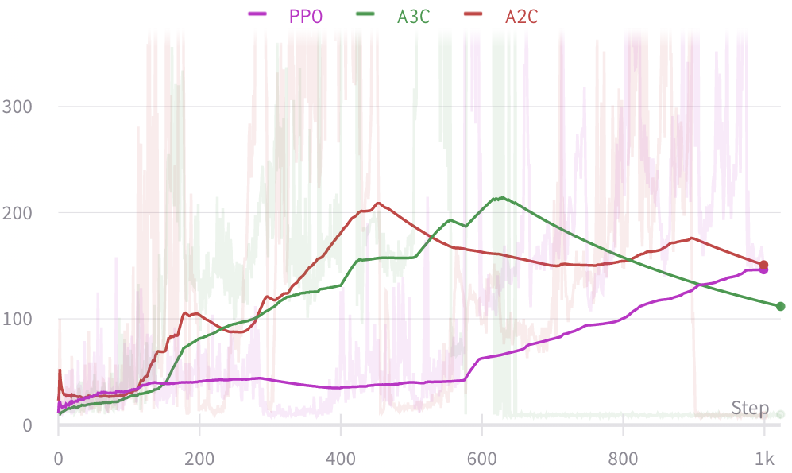

# 🐋 Deep RL in TensorFlow2
This repository contains code and performance comparison metrics that implement popular Deep Reinforcement Learning algorithms in TensorFlow2. Note that this repository is not yet perfect. If you find a better Hyper Parameter Set, we would appreciate it if you let us know! I will continue to update.

|     ENV     |                  Reward Plot                   |
| :---------: | :--------------------------------------------: |
| CartPole-v1 |  |

## Algorithms
|    Name    |     Method      |              Discrete Action               |             Continuous  Action              |
| :--------: | :-------------: | :----------------------------------------: | :-----------------------------------------: |
|    DQN     | TD / Off-Policy |  [Possible](./DQN/dqn_discrete_action.py)  |                 Impossible                  |
|    DRQN    | TD / Off-Policy | [Possible](./DRQN/drqn_discrete_action.py) |                 Impossible                  |
| DuelingDQN | TD / Off-Policy |                  Possible                  |                 Impossible                  |
| DoubleDQN  | TD / Off-Policy |                  Possible                  |                 Impossible                  |
| RainbowDQN | TD / Off-Policy |                  Possible                  |                 Impossible                  |
| REINFORCE  | MC / On-Policy  |                  Possible                  |                  Possible                   |
|    A2C     | TD / On-Policy  |  [Possible](./A2C/a2c_discrete_action.py)  | [Possible](./A2C/a2c_continuous_action.py)  |
|    A3C     | TD / On-Policy  |  [Possible](./A3C/a3c_discrete_action.py)  | [Possible](./A3C/a3c_continuous_action.py)  |
|    PPO     | TD / On-Policy  |  [Possible](./PPO/ppo_discrete_action.py)  | [Possible](./PPO/ppo_continuouts_action.py) |
|    TRPO    | TD / On-Policy  |                  Possible                  |                  Possible                   |
|   ACKTR    | TD / On-Policy  |                  Possible                  |                  Possible                   |
|    ACER    | TD / Off-Policy |                  Possible                  |                  Possible                   |
|    SAC     | TD / Off-Policy |                  Possible                  |                  Possible                   |
|    DDPG    | TD / Off-Policy |                 Impossible                 |                  Possible                   |
|    TD3     | TD / Off-Policy |                 Impossible                 |                  Possible                   |

## Papers

* [Asynchronous Methods for Deep Reinforcement Learning](https://arxiv.org/abs/1602.01783)
* [Proximal Policy Optimization Algorithms](https://arxiv.org/abs/1707.06347)
* [Trust Region Policy Optimization](https://arxiv.org/abs/1502.05477)
* [Playing Atari with Deep Reinforcement Learning](https://arxiv.org/abs/1312.5602)
* [Soft Actor-Critic: Off-Policy Maximum Entropy Deep Reinforcement Learning with a Stochastic Actor](https://arxiv.org/abs/1801.01290)

## Reference
- https://github.com/carpedm20/deep-rl-tensorflow
- https://github.com/Yeachan-Heo/Reinforcement-Learning-Book
- https://github.com/pasus/Reinforcement-Learning-Book
- https://github.com/vcadillog/PPO-Mario-Bros-Tensorflow-2
- https://spinningup.openai.com/en/latest/spinningup/keypapers.html
- https://github.com/seungeunrho/minimalRL
- https://github.com/openai/baselines
- https://github.com/anita-hu/TF2-RL