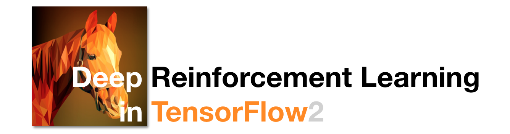
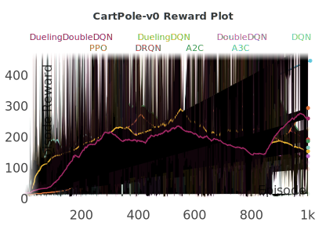

  <br>

<p align="center">
  
</p>

<h2 align=center>Deep Reinforcement Learning in TensorFlow2</h2>

[DeepRL-TensorFlow2](https://github.com/marload/DeepRL-TensorFlow2) is a repository that implements a variety of popular Deep Reinforcement Learning algorithms using [TensorFlow2](https://tensorflow.org). The key to this repository is an easy-to-understand code. Therefore, if you are a student or a researcher studying Deep Reinforcement Learning, I think it would be the **best choice to study** with this repository. One algorithm relies only on one python script file. So you don't have to go in and out of different files to study specific algorithms. This repository is constantly being updated and will continue to add a new Deep Reinforcement Learning algorithm.

<p align="center">
  
</p>

## Algorithms

- [DQN](#dqn)
- [DRQN](#drqn)
- [DoubleDQN](#double_dqn)
- [DuelingDQN](#dueling_dqn)
- [A2C](#a2c)
- [A3C](#a3c)
- [PPO](#ppo)
- [TRPO](#trpo)
- [DDPG](#ddpg)
- [TD3](#td3)
- [SAC](#sac)

<hr>

<a name='dqn'></a>

### DQN

**Paper** [Playing Atari with Deep Reinforcement Learning](https://arxiv.org/abs/1312.5602)<br>
**Author** Volodymyr Mnih, Koray Kavukcuoglu, David Silver, Alex Graves, Ioannis Antonoglou, Daan Wierstra, Martin Riedmiller<br>
**Method** OFF-Policy / Temporal-Diffrence / Model-Free<br>
**Action** Discrete only<br>

#### Core of Idea
```python
# idea01. Approximate Q-Function using NeuralNetwork
def create_model(self):
    model = tf.keras.Sequential([
        Input((self.state_dim,)),
        Dense(32, activation='relu'),
        Dense(16, activation='relu'),
        Dense(self.action_dim)
    ])
    model.compile(loss='mse', optimizer=Adam(args.lr))
    return model

# idea02. Use target network
self.target_model = ActionStateModel(self.state_dim, self.action_dim)
 
# idea03. Use ReplayBuffer to increase data efficiency
class ReplayBuffer:
    def __init__(self, capacity=10000):
        self.buffer = deque(maxlen=capacity)
    
    def put(self, state, action, reward, next_state, done):
        self.buffer.append([state, action, reward, next_state, done])
    
    def sample(self):
        sample = random.sample(self.buffer, args.batch_size)
        states, actions, rewards, next_states, done = map(np.asarray, zip(*sample))
        states = np.array(states).reshape(args.batch_size, -1)
        next_states = np.array(next_states).reshape(args.batch_size, -1)
        return states, actions, rewards, next_states, done
    
    def size(self):
        return len(self.buffer)
```

#### Getting Start
```bash
# Discrete Action Space Deep Q-Learning
$ python DQN/DQN_Discrete.py
```

<hr>

<a name='drqn'></a>


### DRQN

**Paper** [Deep Recurrent Q-Learning for Partially Observable MDPs](https://arxiv.org/abs/1507.06527)<br>
**Author** Matthew Hausknecht, Peter Stone<br>
**Method** OFF-Policy / Temporal-Diffrence / Model-Free<br>
**Action** Discrete only<br>

#### Core of Ideas
```python
# idea01. Previous state uses LSTM layer as feature
def create_model(self):
    return tf.keras.Sequential([
        Input((args.time_steps, self.state_dim)),
        LSTM(32, activation='tanh'),
        Dense(16, activation='relu'),
        Dense(self.action_dim)
    ])
```

#### Getting Start
```bash
# Discrete Action Space Deep Recurrent Q-Learning
$ python DRQN/DRQN_Discrete.py
```

<hr>

<a name='double_dqn'></a>


### DoubleDQN

**Paper** [Deep Reinforcement Learning with Double Q-learning](https://arxiv.org/abs/1509.06461)<br>
**Author** Hado van Hasselt, Arthur Guez, David Silver<br>
**Method** OFF-Policy / Temporal-Diffrence / Model-Free<br>
**Action** Discrete only<br>

#### Core of Ideas
```python
# idea01. Resolved the issue of 'overestimate' in Q Learning
on_action = np.argmax(self.model.predict(next_states), axis=1)
next_q_values = self.target_model.predict(next_states)[range(args.batch_size), on_action]
targets[range(args.batch_size), actions] = rewards + (1-done) * next_q_values * args.gamma
```

#### Getting Start
```bash
# Discrete Action Space Double Deep Q-Learning
$ python DoubleQN/DoubleDQN_Discrete.py
```

<hr>

<a name='dueling_dqn'></a>

### DuelingDQN

**Paper** [Dueling Network Architectures for Deep Reinforcement Learning](https://arxiv.org/abs/1511.06581)<br>
**Author** Ziyu Wang, Tom Schaul, Matteo Hessel, Hado van Hasselt, Marc Lanctot, Nando de Freitas<br>
**Method** OFF-Policy / Temporal-Diffrence / Model-Free<br>
**Action** Discrete only<br>

#### Core of Ideas
```python
# idea01. Q-Function has been separated into Value Function and Advantage Function
def create_model(self):
    backbone = tf.keras.Sequential([
        Input((self.state_dim,)),
        Dense(32, activation='relu'),
        Dense(16, activation='relu')
    ])
    state_input = Input((self.state_dim,))
    backbone_1 = Dense(32, activation='relu')(state_input)
    backbone_2 = Dense(16, activation='relu')(backbone_1)
    value_output = Dense(1)(backbone_2)
    advantage_output = Dense(self.action_dim)(backbone_2)
    output = Add()([value_output, advantage_output])
    model = tf.keras.Model(state_input, output)
    model.compile(loss='mse', optimizer=Adam(args.lr))
    return model
```

#### Gettting Start
```bash
# Discrete Action Space Dueling Deep Q-Learning
$ python DuelingDQN/DuelingDQN_Discrete.py
```

<hr>

<a name='a2c'></a>

### A2C

**Paper** [Actor-Critic Algorithms](https://papers.nips.cc/paper/1786-actor-critic-algorithms.pdf)<br>
**Author** Vijay R. Konda, John N. Tsitsiklis<br>
**Method** ON-Policy / Temporal-Diffrence / Model-Free<br>
**Action** Discrete, Continuous<br>

#### Core of Ideas
```python
# idea01. Use Advantage to reduce Variance
def advatnage(self, td_targets, baselines):
    return td_targets - baselines
```

#### Getting Start
```bash
# Discrete Action Space Advantage Actor-Critic
$ python A2C/A2C_Discrete.py

# Continuous Action Space Advantage Actor-Critic
$ python A2C/A2C_Continuous.py
```

<hr>

<a name='a3c'></a>

### A3C

**Paper** [Asynchronous Methods for Deep Reinforcement Learning](https://arxiv.org/abs/1602.01783)<br>
**Author** Volodymyr Mnih, Adrià Puigdomènech Badia, Mehdi Mirza, Alex Graves, Timothy P. Lillicrap, Tim Harley, David Silver, Koray Kavukcuoglu<br>
**Method** ON-Policy / Temporal-Diffrence / Model-Free<br>
**Action** Discrete, Continuous<br>

#### Core of Ideas
```python
# idea01. Reduce the correlation of data by running asynchronously multiple workers
def train(self, max_episodes=1000):
    workers = []

    for i in range(self.num_workers):
        env = gym.make(self.env_name)
        workers.append(WorkerAgent(
            env, self.global_actor, self.global_critic, max_episodes))

    for worker in workers:
        worker.start()

    for worker in workers:
        worker.join()

# idea02. Improves exploration through entropy loss
entropy_loss = tf.keras.losses.CategoricalCrossentropy(from_logits=True)
```

#### Getting Start
```bash
# Discrete Action Space Asyncronous Advantage Actor-Critic
$ python A3C/A3C_Discrete.py

# Continuous Action Space Asyncronous Advantage Actor-Critic
$ python A3C/A3C_Continuous.py
```

<hr>

<a name='ppo'></a>

### PPO

**Paper** [Proximal Policy Optimization](https://arxiv.org/abs/1707.06347)<br>
**Author** John Schulman, Filip Wolski, Prafulla Dhariwal, Alec Radford, Oleg Klimov<br>
**Method** ON-Policy / Temporal-Diffrence / Model-Free<br>
**Action** Discrete, Continuous<br>

#### Core of ideas
```python
# idea01. Use Importance Sampling to act like an Off-Policy algorithm
# idea02. Use clip to prevent rapid changes in parameters.
def compute_loss(self, old_policy, new_policy, actions, gaes):
    gaes = tf.stop_gradient(gaes)
    old_log_p = tf.math.log(
        tf.reduce_sum(old_policy * actions))
    old_log_p = tf.stop_gradient(old_log_p)
    log_p = tf.math.log(tf.reduce_sum(
        new_policy * actions))
    ratio = tf.math.exp(log_p - old_log_p)
    clipped_ratio = tf.clip_by_value(
        ratio, 1 - args.clip_ratio, 1 + args.clip_ratio)
    surrogate = -tf.minimum(ratio * gaes, clipped_ratio * gaes)
    return tf.reduce_mean(surrogate)
```

#### Getting Start
```bash
# Discrete Action Space Proximal Policy Optimization
$ python PPO/PPO_Discrete.py

# Continuous Action Space Proximal Policy Optimization
$ python PPO/PPO_Continuous.py
```

<hr>

<a name='ddpg'></a>

### DDPG

**Paper** [Continuous control with deep reinforcement learning](https://arxiv.org/abs/1509.02971)<br>
**Author** Timothy P. Lillicrap, Jonathan J. Hunt, Alexander Pritzel, Nicolas Heess, Tom Erez, Yuval Tassa, David Silver, Daan Wierstra<br>
**Method** OFF-Policy / Temporal-Diffrence / Model-Free<br>
**Action** Continuous<br>

#### Core of ideas
```python
# idea01. Use deterministic Actor Model
def create_model(self):
    return tf.keras.Sequential([
        Input((self.state_dim,)),
        Dense(32, activation='relu'),
        Dense(32, activation='relu'),
        Dense(self.action_dim, activation='tanh'),
        Lambda(lambda x: x * self.action_bound)
    ])

# idea02. Add noise to Action
action = np.clip(action + noise, -self.action_bound, self.action_bound)
```

#### Getting Start
```bash
# Continuous Action Space Proximal Policy Optimization
$ python DDPG/DDPG_Continuous.py
```

<hr>

<a name='trpo'></a>

### TRPO

**Paper** [Trust Region Policy Optimization](https://arxiv.org/abs/1502.05477)<br>
**Author** John Schulman, Sergey Levine, Philipp Moritz, Michael I. Jordan, Pieter Abbeel<br>
**Method** OFF-Policy / Temporal-Diffrence / Model-Free<br>
**Action** Discrete, Continuous<br>

```bash
# NOTE: Not yet implemented!
```

<hr>

<a name='td3'></a>

### TD3

**Paper** [Addressing Function Approximation Error in Actor-Critic Methods](https://arxiv.org/abs/1802.09477)<br>
**Author** Scott Fujimoto, Herke van Hoof, David Meger<br>
**Method** OFF-Policy / Temporal-Diffrence / Model-Free<br>
**Action** Continuous<br>

```bash
# NOTE: Not yet implemented!
```

<hr>

<a name='sac'></a>

### SAC

**Paper** [Soft Actor-Critic: Off-Policy Maximum Entropy Deep Reinforcement Learning with a Stochastic Actor
](https://arxiv.org/abs/1801.01290)<br>
**Author** Tuomas Haarnoja, Aurick Zhou, Pieter Abbeel, Sergey Levine<br>
**Method** OFF-Policy / Temporal-Diffrence / Model-Free<br>
**Action** Discrete, Continuous<br>

```bash
# NOTE: Not yet implemented!
```

<hr>

## Reference

- https://github.com/carpedm20/deep-rl-tensorflow
- https://github.com/Yeachan-Heo/Reinforcement-Learning-Book
- https://github.com/pasus/Reinforcement-Learning-Book
- https://github.com/vcadillog/PPO-Mario-Bros-Tensorflow-2
- https://spinningup.openai.com/en/latest/spinningup/keypapers.html
- https://github.com/seungeunrho/minimalRL
- https://github.com/openai/baselines
- https://github.com/anita-hu/TF2-RL
